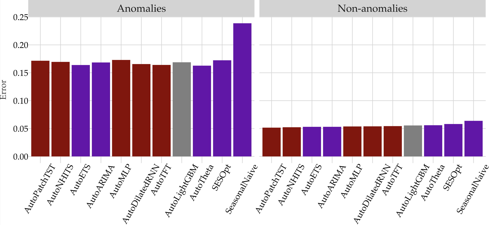

# ModelRadar - Experiments

This repository contains the experiments for the paper "ModelRadar: Aspect-based Forecasting Accuracy" (Cerqueira et al., 2025).
[ModelRadar](https://github.com/vcerqueira/modelradar) is a framework for evaluating forecasting performance across different dimensions of interest. 

## Getting Started

### Prerequisites

- Python 3.9+
- PyTorch
- modelradar
- Install dependencies listed in `requirements.txt` using:

```bash
pip install -r requirements.txt
```

## Running Experiments

To reproduce the experiments from the paper:

1. Execute the experimental scripts in the folder scripts/experiments/run. For example:

```bash
python scripts/experiments/run/nf.py
```

2. Analyze the results with the scripts on folder scripts/experiments/analysis. For example:
```bash
python scripts/experiments/analysis/3_analysis.py
```

## Results overview

Here's an overview of the forecast accuracy (SMAPE) of several models across different dimensions:

Accuracy scores over several dimensions 


Controlling accuracy by anomaly status


You can find several other plots in the folder *scripts/experiments/outputs*

## Citation

If you use this code in your research, please cite:

```bibtex
@article{todo,
  title={todo},
  author={todo},
  journal={todo},
  year={todo}
}
```

## Contact

For questions or feedback about this implementation, please open an issue in this repository.
